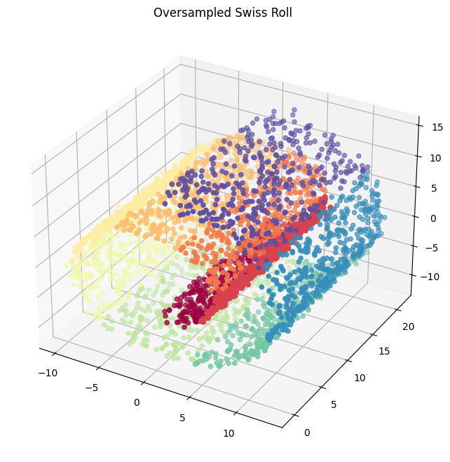
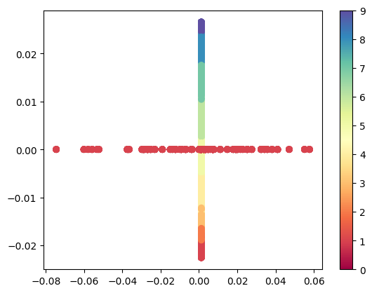
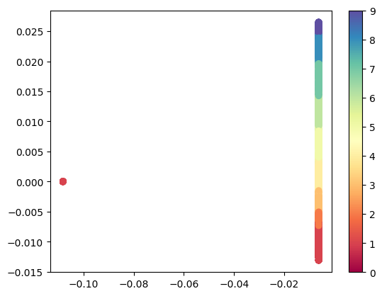

## Dimensionality Reduction and the Fenchel Game

[Link to paper](../pdf/REU_draft.pdf){: .small-link}

[Accompanying Repo page](/REU_Repo_page){: .small-link}


**Abstract:** In this paper, we review the linear dimensionality reduction algorithm Principal Component Analysis (PCA), as well as the non-linear reduction algorithms Isomap and Laplacian Eigenmaps. 

We then examine a novel framework (Fenchel Game No Regret Dynamics) for converting convex function minimization into min-max style games, and apply one such method to a reformulation of PCA. 

This paper also proposes an improvement to Laplacian Eigenmaps to maintain structure despite oversampling, as visualized below.

<p align="center">
  <figure style="text-align: center;">
    
    <figcaption> Oversampled Swiss Roll </figcaption>
  </figure>

  <figure style="display: inline-block; text-align: center;">
    
    <figcaption>Standard LE Reduction </figcaption>
  </figure>

  <figure style="display: inline-block; text-align: center;">
    
    <figcaption> Variable Radius LE Reduction</figcaption>
  </figure>
</p>

<!--
### 1. PCA

Principal Component Analysis

```javascript
if (isAwesome){
  return true
}
```

### 2. Laplacian Eigenmaps

### 3. Isomap


### 4. Provide a basis for further data collection through surveys or experiments

Sed ut perspiciatis unde omnis iste natus error sit voluptatem accusantium doloremque laudantium, totam rem aperiam, eaque ipsa quae ab illo inventore veritatis et quasi architecto beatae vitae dicta sunt explicabo. 

For more details see [GitHub Flavored Markdown](https://guides.github.com/features/mastering-markdown/).
-->

